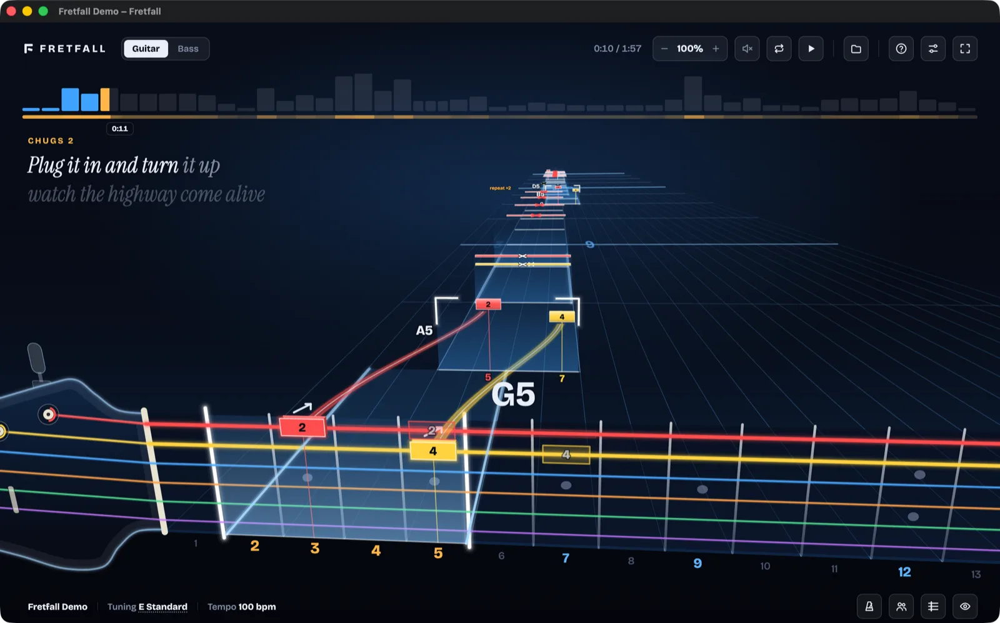

# Fretfall Player

An arcade-style note highway for Guitar Pro and MusicXML tabs, in the browser.

[](https://github.com/fretfall/player/actions/workflows/ci.yml)
[](https://github.com/fretfall/player/actions/workflows/perf.yml)
[](https://www.npmjs.com/package/@fretfall/player)
[](LICENSE)

[**Try it**](https://fretfall.github.io/player/) — the demo is the published package with a front door of its own, served from GitHub Pages.



Open a tab and play along: the notes fall down a 3D fretboard, with hand positions and fingering worked out for you. Add the
band's recording and the player lines the tab up with it on its own.

- **Formats**: `.gp`, `.gp3`–`.gp5`, `.gpx`, `.musicxml`, `.mxl`, plus `.mp3`, `.m4a`, `.ogg`, `.wav`, `.flac` recordings
- **Practice**: phrase loops, speed control with a speed trainer, metronome, 3D highway or tablature
- **Band**: every part in a window of its own, all in time
- **Lean**: plain HTML and ES modules, no framework, no runtime dependencies, about 58 kB gzipped

## Quick start

```sh
npm install @fretfall/player
npx serve node_modules/@fretfall/player
```

Any static file server works. Tabs are read and played by [alphaTab](https://www.alphatab.net), loaded from jsDelivr.

## Build on it

Serve the package's files and add your own page around it. The player starts with no song of its own — the page around it
opens the first one, as the demo's front door does with its demo tab. The player exposes `window.fretfall` once it dispatches
`fretfall:ready`:

```js
if (!window.fretfall) await new Promise((ready) => addEventListener('fretfall:ready', ready, { once: true }));

addEventListener('fretfall:song', (e) => console.log(e.detail.title, e.detail.parts));
await fretfall.open(files, { audio: recording }); // File[] from an input or a drop
fretfall.part = 1;
```

| Member | |
|:--|:--|
| `open(files, options)` / `pick()` | Open songs, or show the file dialog |
| `playing`, `time`, `length` | Where playback is, in seconds. `playing` is settable: it waits for the synth's instruments. So is `time`: a jump to there, kept within the song |
| `parts`, `part` | The song's parts, and the one shown (settable) |
| `notes` | What the part shown asks for: the open strings, and each note's time, string, fret and midi note. A copy each read |
| `offset`, `snap()` | The open song's own nudge in ms, on top of how the player lined its recording up and of Audio delay (the device's): positive makes the notes later. Settable once the song is open; a new song starts at 0. It moves the song's clock: `time`, seeks and the loop go by it. `snap()` sets it so the tab's first note lands on its attack in the recording and returns it (`null` without a recording lined up here): near where the player's fit puts that note when the fit is sure, else the recording's first loud sound, which a count-in can be |
| `speed` | How fast it plays, 1 being the song's own tempo. Settable, in the player's steps of a tenth from 0.1 to 1.5 |
| `style` | The look: note shape, colour set, fonts, string colours, headstock. Settable whole or in part |
| `volume`, `muted` | 0 to 1, and the mute. Settable; a volume of 0 is muted, and setting one asks for sound again |
| `loop` | `{ start, end }` in seconds, or `null`. Settable: kept inside the song, and anything else clears it |
| `metronome` | The click, on the chart's beats. Settable |
| `sheet` | Which sheet is open: `'settings'`, `'legend'` or `null`. Settable |
| `fullscreen` | Settable — set it from your own button's click, as browsers want a gesture behind it |
| `controls` | Everything above that a control toggles, in one object, for a bar of your own to draw itself from |
| `addFormat({ name, extensions, open })` | Read another file type: `open(file)` resolves to `{ song, audio }` |
| `closeSheets()` | Close Settings and the notation sheet |
| `dock(element, more?)` | Mounted in a page: the header's controls in an element of the page's own, see below |

Events on `window`: `fretfall:ready`, `fretfall:song`, `fretfall:playing`, `fretfall:sheet`, `fretfall:controls`. The modules import on their own
too, for example `music.js` for tunings and note names.

### In a page of your own

A page that isn't the player's, a React app's say, mounts it in an element instead. `mount.js` is written from the player's
page by the build, so it carries the same markup and styles, kept to that element:

```js
import { mount } from '@fretfall/player/mount.js';

const fretfall = await mount(element); // window.fretfall, once fretfall:ready has fired
```

- **Once a page.** The player's modules run once and there is no unmount: a second call returns the first one's promise. Keep
  the element and hide it (`hidden`, `display: none`) rather than removing it; hidden, the player draws nothing and leaves
  the keys alone. It plays on, so pause it first: `fretfall.playing = false`.
- **The element needs a size**, a height above all: the player fills it, whether that is the whole screen or a hero. Inside,
  it is a box of its own (`contain: layout`): its bar and sheets stay in it, and full screen is that box's.
- **The ids in the player are its own** — `play`, `open`, `menu`, `settings`, `file`, `fonts` and a hundred more — so the page
  around it must not use them; `mount()` rejects if it finds one taken. Its small-screen layouts still follow the window's
  width, not the element's.
- The page around it stays the page's: its styles, its title (follow `fretfall:song` to set one), keys pressed in its inputs
  and on its buttons, and files dropped outside the player. With the focus nowhere, the shortcuts are the player's. Band
  windows open the page's own URL with `?band=`, so that URL has to mount the player again.

#### One bar: the player's controls in the page's own

A page with a bar of its own has two once the player is in it. `fretfall.dock(element)` moves the header's controls — the
part picker, time, speed, volume, loop, play, open, help, settings and full screen — into `element`, and hides the player's
header while they are there, so the highway starts at the top of its element. They are the player's own buttons, styled
by its stylesheet: `element` is marked `data-fretfall` (and `data-fretfall-dock`) so that reaches it, in its own colours
and fonts rather than the theme's — set the variables it draws with (`--chip`, `--chip-border`, `--ink`, `--text`,
`--muted`, `--accent`, `--ui`, `--num`) on the element for your bar's, and hide or restyle what your bar does differently
under that attribute. `fretfall.dock(element, more)` puts help, settings and full screen into `more` instead, for a bar
with a right side of its own. The tooltips and the volume slider open under the buttons, where they stand now; under
900 px wide the slider opens at the right edge of the volume button's nearest positioned ancestor, so give your bar
`position: relative`. Keep `element` (and `more`) for the tools alone: the stylesheet reaches every child of an element
marked `data-fretfall`, so anything else of yours in there picks up the player's rules. Keys pressed on the tools are the
player's, on the rest of the page the page's. Full screen shows the player alone, so the tools come home meanwhile and go
back when it ends. `fretfall.dock(null)` brings everything home, and a page removing its bar has to call it first, or the controls go with
it (`demo/mount.html` shows a dock).

#### Controls of your own

`dock()` moves the player's controls into your bar. To build your own instead, everything they do is on the hook —
`playing`, `time`, `speed`, `volume`, `muted`, `loop`, `metronome`, `part`, `sheet`, `fullscreen`, `pick()` — so your
buttons drive the player without reaching into its markup. `fretfall.controls` is the lot in one object, and
`fretfall:controls` fires whenever any of them changes, whoever changed it: one listener, one re-render, rather than an
event per knob. The player's own controls stay in step, so you can dock some and build others.

```js
const bar = () => { const c = fretfall.controls; play.textContent = c.playing ? 'Pause' : 'Play'; /* … */ };
addEventListener('fretfall:controls', bar);
play.onclick = () => (fretfall.playing = !fretfall.playing);
```

Types come with it (`mount.d.ts`): `mount()`, the `fretfall` hook and its events.

Keys: <kbd>Space</kbd> play · <kbd>L</kbd> loop · <kbd>O</kbd> open · <kbd>D</kbd> tablature · <kbd>K</kbd> metronome ·
<kbd>F</kbd> full screen · <kbd>S</kbd> settings · <kbd>?</kbd> everything else. Add `?perf` to the URL for a frame profiler.

## Develop

```sh
npm ci
npm start         # the demo on http://localhost:4410, rebuilt from src/ on every request
npm test          # node --test
npm run lint      # oxlint: correctness and performance rules
npm run build     # dist/, the published package (DEMO=1: with the demo's front door, as github.io serves it)
npm run bench     # frame time, draw calls, sync and size of dist/
```

`src/` is the player's modules, `demo/` the page they ship with, and the demo's front door and tab. The build flattens both
into `dist/`, which is what npm publishes and what the demo serves — so the page next to the modules, as a page built on the
player has it. The front door, between `<!-- demo -->` and `<!-- /demo -->` in the page, stays out of the package.

`demo/mount.html` tries the mounted player, in a page with a look and an input of its own. `mount.js` only exists once built,
so it is served from the built demo: `DEMO=1 npm run build && npx serve dist`, then `/mount.html`.

No pull request may make the player slower or bigger. CI builds it and the base branch, benchmarks both in turns on the same
runner, and fails on more than 10% frame or sync time, 5% draw calls or 1% gzipped size. A regression taken on purpose
passes with the `perf-ok` label.

Releases: bump `version`, publish a GitHub release tagged `v<version>`, and CI publishes to npm with provenance.

## Contributing

Help is welcome — a bug report with a tab that reproduces it is as useful as a patch.

- **Something broken?** [Open an issue](https://github.com/fretfall/player/issues/new/choose). Say which file, which browser,
  and what you expected; attach the tab if you can share it.
- **An idea, or not sure it belongs?** Open an issue before you build it. The player stays small on purpose, and it is easier
  to say "yes, but over here" before the work than after.
- **Small and obvious?** A typo, a clear fix — just send the pull request.

Then: fork, branch off `main`, and before you push run `npm run lint && npm test && npm run build`, which is what CI runs.
Add or extend a `*.test.mjs` next to the module you touched — plain `node:assert`, no framework — and keep the diff to the
change you are making. Commit subjects read as [Conventional Commits](https://www.conventionalcommits.org) (`fix:`, `feat:`,
`docs:`, `chore:`, `refactor:`), because the release notes are written from them.

Two house rules, both enforced by CI: the player has **no runtime dependencies** and **no framework** — plain ES modules and
the platform — and **no pull request may make it slower or bigger** (see the budgets above). Match the style of the file you
are in rather than any style guide; there is no formatter, and a reformatted file makes a review impossible.

## License

[MIT](LICENSE)
